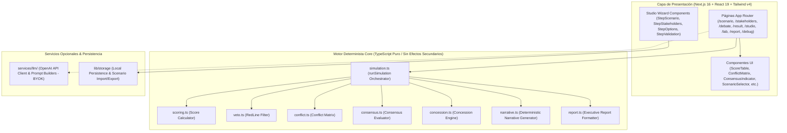

# Convergia

<p align="center">
  
</p>

<h3 align="center">Convergia</h3>

<p align="center">
  <strong>Simulador Determinista de Decisiones Multi-Stakeholder para Entornos Industriales</strong>
</p>

<p align="center">
  <em>Modelado riguroso del conflicto organizacional, vetos, matrices de concordancia y convergencia por concesiones iterativas.</em>
</p>

<p align="center">
  <a href="https://nextjs.org/"></a>
  <a href="https://react.dev/"></a>
  <a href="https://www.typescriptlang.org/"></a>
  <a href="https://tailwindcss.com/"></a>
  <a href="https://vitest.dev/"></a>
  <a href="https://opensource.org/licenses/MIT"></a>
</p>

---

> [!IMPORTANT]
> **Arquitectura Core 100% Determinista**: Convergia calcula scores, vetos, matrices de conflicto y dinámicas de concesión mediante un motor matemático determinista puro. Ningún cálculo ni resultado depende de aleatoriedad o inteligencia artificial generativa. La integración con LLM es **100% opcional (BYOK - Bring Your Own Key)** y actúa únicamente como capa de fluidez narrativa sobre los datos previamente auditados.

> 📋 **¿Vas a presentar o evaluar el proyecto?** Consulta la guía completa de presentación en [`DEMO.md`](./DEMO.md), que incluye scripts paso a paso para demos de 3 y 5 minutos, respuestas a FAQs técnicas y rutas de impacto visual.

---

## 💡 Visión General y El Problema

En cualquier organización o planta industrial, las decisiones estratégicas de inversión (digitalización, sostenibilidad, ampliación de planta, automatización) **nunca las toma un decisor único**. Intervienen múltiples departamentos:

* **Dirección de Producción**: Maximiza la eficiencia operacional y minimiza los tiempos de parada.
* **Garantía de Calidad**: Prioriza el cumplimiento estricto y la tolerancia cero a defectos.
* **Dirección Financiera (CFO)**: Exige un ROI elevado, bajo CAPEX y rápido payback.
* **Sostenibilidad y EHS**: Enfocado en reducción de huella de carbono y cumplimiento medioambiental.

### El Desafío Metodológico

Las herramientas tradicionales de Decisión Multicriterio (MCDM) suelen asumir un decisor global unificado o agregan prioridades mediante promedios ponderados simples, **ocultando el conflicto real entre partes**.

**Convergia sitúa el conflicto inter-departamental en el centro del análisis.** Simula cómo actores con prioridades asimétricas, líneas rojas infranqueables y umbrales de negociación heterogéneos debaten por rondas hasta alcanzar —o no— un consenso transparente, auditable y justificado.

---

## ✨ Propuesta de Valor y Pilares Técnicos

| Pilar | Descripción Técnica |
| :--- | :--- |
| 🎯 **Motor Determinista Puro** | Expresado como una función pura $f(\text{Escenario}, \text{Stakeholders}) \to \text{SimulationResult}$. Mismo input garantiza idéntico output con un 100% de reproducibilidad. |
| 👥 **Multi-Stakeholder Asimétrico** | Soporta múltiples decisores con vectores de pesos ponderados, restricciones de vetos duras y parámetros de flexibilidad configurables. |
| 🔄 **Negociación Dinámica por Rondas** | Algoritmo de concesión iterativa: cuando el desajuste entre la opción preferida y la ganadora global supera el umbral de un stakeholder, este flexibiliza progresivamente sus prioridades. |
| 🛡️ **Explicabilidad Matemáticamente Derivada** | Toda la narrativa explicativa del sistema (`narrative.ts`) se genera a partir de causas algebraicas en los datos calculados. No hay alucinaciones. |
| 🎛️ **Scenario Builder Studio & Sensitivity Lab** | Entorno visual en 5 pasos para crear, validar e importar nuevos escenarios industriales (`/studio`) y laboratorio en tiempo real para análisis de sensibilidad (`/lab`). |
| 📄 **Informe Ejecutivo de Decisión** | Vista de reporte estructurado (`/report`) apto para impresión/exportación PDF con matriz de riesgo, justificación de concesiones y resumen auditable. |
| 🤖 **Enriquecimiento por IA (Opcional)** | Integración modular con OpenAI API (`/services/llm`) que genera redactados narrativos ejecutivos manteniendo el motor determinista como única fuente de verdad. |

---

## 🗺️ Mapa de Módulos y Navegación de la Aplicación

Convergia cuenta con una arquitectura de presentación completa basada en **Next.js 16 App Router**:

| Ruta | Nombre del Módulo | Propósito y Funcionalidad |
| :--- | :--- | :--- |
| [`/`](./src/app/page.tsx) | **Landing & Hub Principal** | Presentación ejecutiva del proyecto, propuesta de valor, stack y accesos a flujos interactivos. |
| [`/scenario`](./src/app/scenario/page.tsx) | **Explorador de Escenarios** | Selección entre los 3 escenarios industriales reales preconfigurados y vista de KPIs. |
| [`/stakeholders`](./src/app/stakeholders/page.tsx) | **Perfiles de Decisores** | Inspección de pesos por variable, líneas rojas (vetos), misiones y parámetros de negociación. |
| [`/debate`](./src/app/debate/page.tsx) | **Simulador de Debate** | Visualizador interactivo ronda por ronda de scoring, matrices de conflicto, concesiones y argumentos. |
| [`/result`](./src/app/result/page.tsx) | **Consenso y Resultado Final** | Dictamen final de consenso (Full, Partial, Tie, None), desglose por stakeholder y narrativa explicativa. |
| [`/report`](./src/app/report/page.tsx) | **Informe Ejecutivo** | Plantilla de informe formal de decisión industrial, optimizada para exportación a PDF o impresión. |
| [`/studio`](./src/app/studio/page.tsx) | **Scenario Builder Studio** | Creador visual en 5 pasos con validación matemática en tiempo real, importación y exportación JSON. |
| [`/lab`](./src/app/lab/page.tsx) | **Sensitivity Lab** | Laboratorio interactivo para simular variaciones continuas de pesos y observar la respuesta del motor en vivo. |
| [`/demo`](./src/app/demo/page.tsx) | **Guided Pitch Demo Mode** | Flujo guiado paso a paso con scripts contextuales para presentaciones académicas o entrevistas. |
| [`/debug`](./src/app/debug/page.tsx) | **Engine State Inspector** | Auditoría técnica profunda: matrices crudas de scores, vetos, rankings intermedios y payload JSON. |

---

## 🏭 Escenarios Industriales Preconfigurados

Convergia incluye 3 escenarios de negocio complejos listos para ejecutar out-of-the-box:

```
                  ┌──────────────────────────────────────────────┐
                  │            ESCENARIOS INDUSTRIALES           │
                  └──────┬──────────────────────┬─────────┬──────┘
                         │                      │         │
      ┌──────────────────┴───────────┐          │         └─────────────────────────────┐
      ▼                              ▼                                                    ▼
┌──────────────────────────┐   ┌──────────────────────────┐                   ┌──────────────────────────┐
│   MetalWorks S.A.        │   │   EnergyChem Transition  │                   │   PharmaQuality 4.0      │
│ Presupuesto: 450.000 €   │   │ Presupuesto: 1.200.000 € │                   │ Presupuesto: 850.000 €   │
│ Modernización de planta  │   │ Descarbonización & EHS   │                   │ Digitalización & MES     │
│ 5 Opciones · 4 Decisores │   │ 5 Opciones · 4 Decisores │                   │ 5 Opciones · 4 Decisores │
└──────────────────────────┘   └──────────────────────────┘                   └──────────────────────────┘
```

1. **MetalWorks S.A.** *(Modernización de Planta Metalmecánica)*
   * **Contexto**: Empresa de 250 empleados que busca optimizar su parque de maquinaria con 450 k€ de presupuesto.
   * **Decisores**: Director de Producción, Directora de Calidad, Director Financiero y Responsable de Sostenibilidad.
2. **EnergyChem Eco-Transition** *(Descarbonización en Procesos Químicos)*
   * **Contexto**: Complejo químico con meta de reducción de emisiones y eficiencia térmica con 1,2 M€ de presupuesto.
   * **Decisores**: Director de Operaciones, Directora EHS & Sostenibilidad, CFO y Director de R&D / Innovación.
3. **PharmaQuality 4.0** *(Trazabilidad e Integración de Sistemas MES/LIMS)*
   * **Contexto**: Planta farmacéutica bajo regulación estricta FDA/EMA invirtiendo 850 k€ en digitalización.
   * **Decisores**: Directora de QA / Compliance, Jefe de Planta, Director de IT & Automatización y Director de Finanzas.

---

## 📐 Algoritmo Matemático y Modelo de Negociación

El motor en [`src/engine/`](./src/engine/) formaliza el proceso de decisión mediante 5 etapas consecutivas:

```
 ┌───────────────┐     ┌───────────────┐     ┌───────────────┐     ┌───────────────┐     ┌───────────────┐
 │   1. SCORING  │ ──> │   2. VETOS    │ ──> │ 3. MATRIZ DE  │ ──> │ 4. CONCESIÓN  │ ──> │ 5. DICTAMEN DE│
 │  PONDERADO    │     │  Y FILTRADO   │     │   CONFLICTO   │     │   ITERATIVA   │     │   CONSENSO    │
 └───────────────┘     └───────────────┘     └───────────────┘     └───────────────┘     └───────────────┘
```

### 1. Formulación del Scoring Ponderado
Dado un conjunto de variables de impacto $V$ (donde $|V| = 6$: *Eficiencia Productiva*, *Mejora de Calidad*, *Retorno Financiero*, *Impacto Ambiental*, *Riesgo de Implementación*, *Resiliencia Operacional*), para cada stakeholder $s$ y opción de inversión $o$:

$$\text{Score}_{s,o} = \sum_{v \in V} w_{s,v} \cdot \text{Impact}_{o,v}$$

El **Score Global** de la opción $o$ en la ronda $r$ es el promedio ponderado de los decisores activos:

$$\text{GlobalScore}_o = \frac{1}{|S|} \sum_{s \in S} \text{Score}_{s,o}$$

### 2. Detección de Vetos (Líneas Rojas)
Una opción $o$ es vetada por el stakeholder $s$ si viola alguna restricción dura:

$$\exists r \in \text{RedLines}_s : \begin{cases} \text{Impact}_{o,v} < \text{Threshold}_r & \text{si el operador es } < \\ \text{Impact}_{o,v} > \text{Threshold}_r & \text{si el operador es } > \end{cases}$$

Si una opción acumula $\ge 2$ vetos de distintos stakeholders, queda **eliminada automáticamente** del proceso de decisión.

### 3. Matriz de Conflicto Inter-Stakeholder
La disonancia de preferencias entre dos stakeholders $s_i$ y $s_j$ se calcula mediante la distancia media de sus utilidades sobre el conjunto de opciones válidas $O$:

$$\text{Conflict}(s_i, s_j) = \frac{1}{|O|} \sum_{o \in O} |\text{Score}_{s_i,o} - \text{Score}_{s_j,o}|$$

El **Conflicto Total** del sistema es la suma normalizada de la matriz simétrica de conflicto.

### 4. Mecánica de Concesiones Iterativas
En cada ronda $r$, el motor identifica a los stakeholders cuya opción preferida individual ($\text{Preferred}_s$) no coincide con la opción líder global ($\text{Leader}$).

Si la brecha de utilidad cumple:

$$\Delta_s = \text{Score}_{s, \text{Preferred}_s} - \text{Score}_{s, \text{Leader}} > \text{ConcessionThreshold}_s$$

El stakeholder $s$ realiza una **concesión**: reduce el peso de su variable más crítica en una tasa $\tau_s = \text{ConcessionRate}_s$ y redistribuye equitativamente el peso cedido entre el resto de variables. Con los nuevos pesos $w'_{s,v}$, el motor ejecuta la siguiente ronda.

### 5. Dictamen de Consenso
El estado final de consenso se clasifica según la aceptabilidad de la opción ganadora tras finalizar las rondas:

* 🟢 **Consenso Total (`full`)**: La opción ganadora supera el `acceptabilityThreshold` de **todos** los stakeholders y no posee vetos.
* 🟡 **Consenso Parcial (`partial`)**: La opción ganadora es aceptada por la mayoría de los stakeholders, pero existe al menos un disidente.
* 🟠 **Empate (`tie`)**: Dos o más opciones obtienen la misma puntuación global dentro de un margen de tolerancia.
* 🔴 **Sin Consenso (`none`)**: Las concesiones se agotan sin que ninguna opción alcance la aceptabilidad mínima colectiva.

---

## 🏗️ Arquitectura de Software

El proyecto sigue una arquitectura desacoplada estricta, separando el dominio matemático puramente funcional de la interfaz visual y de la capa opcional de IA:



---

## 🛠️ Scenario Builder Studio & Sensitivity Lab

Convergia no se limita a escenarios estáticos. Incluye herramientas avanzadas para la creación y experimentación:

### 🎛️ Scenario Builder Studio (`/studio`)
Un entorno de creación guiado en 5 pasos que permite construir escenarios industriales personalizados:

1. **Escenario Base**: Nombre, empresa, presupuesto y KPIs.
2. **Decisores (Stakeholders)**: Definición de roles, misiones, pesos por variable, líneas rojas y parámetros de negociación.
3. **Opciones de Inversión**: Definición de costes, ventajas y matriz de impactos en las 6 variables.
4. **Validación Automática**: Motor de reglas que verifica la consistencia del presupuesto, suma de pesos (=1.0), presencia de líneas rojas coherentes y ausencia de contradicciones.
5. **Preview & Exportación**: Previsualización inmediata del resultado de simulación e importación/exportación en JSON.

### 🧪 Sensitivity Lab (`/lab`)
Permite a investigadores, consultores o estudiantes ajustar deslizadores interactivos de pesos en tiempo real y observar instantáneamente cómo muta la matriz de conflicto, qué opciones sufren vetos y cómo cambia el ganador final.

---

## 🤖 Capa de Enriquecimiento por IA (Opcional - BYOK)

El sistema soporta enriquecimiento narrativo opcional alimentado por modelos LLM (OpenAI GPT-4o / GPT-4o-mini):

* **Foco Exclusivo en Prosa**: El LLM **nunca** calcula ni modifica scores, vetos o resultados. Recibe las estructuras del motor como entrada fija y genera redacción ejecutiva fluida.
* **Resiliencia & Fallback**: Si no se proporciona una API Key (`.env.local` o interfaz), o si la llamada a la API falla o expira, Convergia conmuta instantáneamente a las narrativas deterministas nativas generadas en [`src/engine/narrative.ts`](./src/engine/narrative.ts).

---

## 💻 Instalación, Ejecución y Desarrollo

### Requisitos Previos
* **Node.js**: `v18.17.0` o superior (se recomienda Node 20 LTS).
* **Gestor de paquetes**: `npm` (incluido en Node) o `pnpm`.

### Pasos de Instalación

```bash
# 1. Clonar el repositorio
git clone https://github.com/markusx5622/Convergia.git
cd Convergia

# 2. Instalar dependencias
npm install

# 3. Iniciar el servidor de desarrollo (con Turbopack)
npm run dev
```

La aplicación estará disponible en `http://localhost:3000`.

### Variables de Entorno Opcionales (para Enriquecimiento IA)

Crea un archivo `.env.local` en la raíz del proyecto si deseas probar la capa de IA opcional:

```env
NEXT_PUBLIC_OPENAI_API_KEY=tu_api_key_aqui
```

---

## 🧪 Testing y Calidad de Código

Convergia incluye una suite de pruebas automatizadas impulsada por **Vitest** para garantizar el rigor del motor y del constructor de escenarios:

```bash
# Ejecutar la suite completa de tests unitarios e integración
npm run test

# Modo observador (watch) para desarrollo continuo
npm run test:watch
```

Los tests cubren:
* ✅ Validaciones matemáticas de consistencia en escenarios (`builder-validation.test.ts`).
* ✅ Conversión de tipos y esquemas DTO (`builder-convert.test.ts`).
* ✅ Persistencia local y serialización JSON de escenarios (`builder-persistence.test.ts`).

---

## 📁 Estructura del Proyecto

```
Convergia/
├── DEMO.md                         # Guía paso a paso para presentaciones y demos de 3 y 5 min
├── README.md                       # Documentación principal del repositorio
├── package.json                    # Dependencias (Next.js 16, React 19, Tailwind 4, Vitest)
├── tsconfig.json                   # Configuración de TypeScript en modo estricto
├── vitest.config.ts                # Configuración de Vitest para ejecuciones de prueba
├── public/                         # Recursos estáticos, favicons e imágenes
└── src/
    ├── __tests__/                  # Suite de pruebas automatizadas con Vitest
    │   ├── builder-convert.test.ts
    │   ├── builder-persistence.test.ts
    │   └── builder-validation.test.ts
    ├── app/                        # Router de aplicación (Next.js 16 App Router)
    │   ├── page.tsx                # Landing Principal
    │   ├── layout.tsx              # Layout global de la aplicación
    │   ├── globals.css             # Configuración CSS de Tailwind v4
    │   ├── scenario/               # Selector de escenarios
    │   ├── stakeholders/           # Perfiles de decisores y matriz de pesos
    │   ├── debate/                 # Simulador interactivo de debate por rondas
    │   ├── result/                 # Dictamen final y narrativa de consenso
    │   ├── report/                 # Generador de Informe Ejecutivo imprimible
    │   ├── studio/                 # Scenario Builder Studio (Creador visual)
    │   ├── lab/                    # Sensitivity Lab (Análisis de sensibilidad)
    │   ├── demo/                   # Pitch Mode guiado
    │   └── debug/                  # Inspección de estado interno del motor
    ├── components/                 # Componentes React modularizados
    │   ├── builder/                # Componentes del wizard del Scenario Builder
    │   ├── AIConfigPanel.tsx       # Configuración opcional de API Key OpenAI
    │   ├── ComparisonPanel.tsx     # Comparativa global de opciones
    │   ├── ConflictMatrix.tsx      # Matriz de disonancia inter-stakeholder
    │   ├── ConsensusIndicator.tsx  # Badge y medidor visual de estado de consenso
    │   ├── OptionCard.tsx          # Tarjeta detallada de opción de inversión
    │   ├── ReportView.tsx          # Layout de informe ejecutivo para PDF/Print
    │   ├── ResultSummary.tsx       # Resumen ejecutivo de consenso
    │   ├── ScoreTable.tsx          # Tabla comparativa de scores ponderados
    │   ├── StakeholderCard.tsx     # Tarjeta de perfil de decisor
    │   └── StakeholderWeightSliders.tsx # Deslizadores interactivos de pesos
    ├── data/                       # Dataset de escenarios preconfigurados
    │   ├── scenario.ts             # Dataset activo por defecto
    │   ├── stakeholders.ts         # Colección de decisores
    │   ├── options.ts              # Opciones de inversión
    │   └── scenarios/              # Definiciones complejas (MetalWorks, EnergyChem, PharmaQuality)
    ├── engine/                     # MOTOR DETERMINISTA CORE (TypeScript Puro)
    │   ├── simulation.ts           # Orquestador principal (runSimulation)
    │   ├── scoring.ts              # Cálculo de utilidades y scores ponderados
    │   ├── veto.ts                 # Detección y filtrado por líneas rojas
    │   ├── conflict.ts             # Matriz de conflicto y disonancia
    │   ├── consensus.ts            # Clasificador de estado de consenso
    │   ├── concession.ts           # Mecánica de concesiones iterativas
    │   ├── narrative.ts            # Generador determinista de explicación narrativa
    │   ├── report.ts               # Formateador de datos para informe ejecutivo
    │   └── types.ts                # Sistema de tipos compartidos (TypeScript Strict)
    ├── lib/                        # Helpers y utilidades de almacenamiento local
    └── services/                   # Servicios externos (OpenAI LLM Integration)
        └── llm/                    # Client, Prompts y Orchestrator de enriquecimiento IA
```

---

## 🎓 Relevancia Académica e Industrial

### 🏬 Ingeniería en Organización Industrial & Management
* **Modelado de MCDM (Multi-Criteria Decision Making)**: Aplicación práctica de metodologías multicriterio con decisores en conflicto real.
* **Teoría de Juegos y Negociación**: Representación explícita de concesiones iterativas, vetos y fronteras de acuerdo.
* **Trazabilidad y Gobierno de Decisiones**: Justificación auditable paso a paso exigida en entornos altamente regulados.

### 💻 Ingeniería de Software & Arquitectura
* **Clean Architecture & Functional Pureness**: El motor es agnóstico del framework web y puede ser reutilizado en cualquier entorno TypeScript (Node.js, CLI, Serverless).
* **TypeScript Avanzado**: Sistema de tipos estricto que elimina clases enteras de errores en tiempo de compilación.
* **Modern Web Stack**: Next.js 16 App Router, React 19, Tailwind CSS v4 y Vitest.

---

## 📄 Licencia

Este proyecto está bajo la Licencia **MIT**. Puedes consultar el archivo `LICENSE` para más detalles.

---

<p align="center">
  <sub>Desarrollado con rigor metodológico para simulación de decisiones de inversión industrial.</sub><br/>
  <strong>Convergia</strong> · Engine & Web Platform
</p>